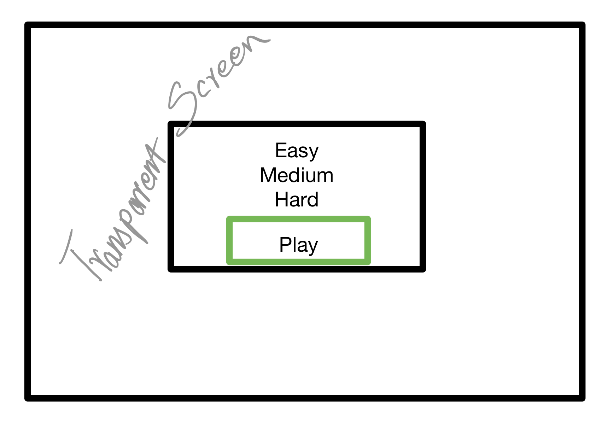
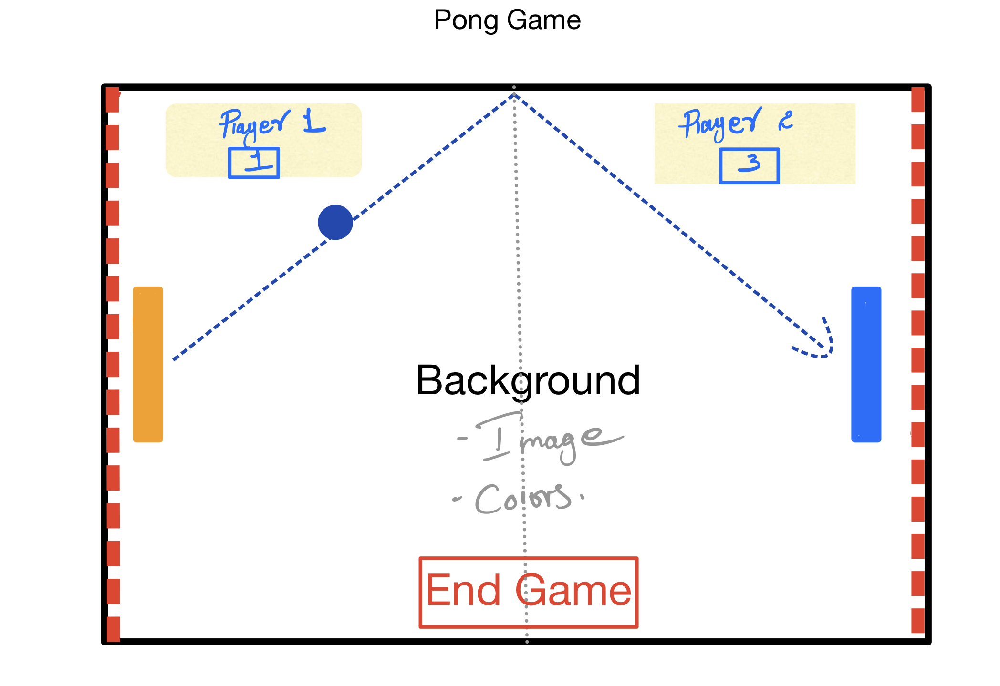

# Project-One-Pong-Game
## Pong game has the following components:

* The game board
* Net in the middle
* Two Score text on either side
* Two Paddles, the user1 and the user2
* And our Ping Pong Ball.

## How to win or loose the game
* When the user1 misses the ball which the user2 had hit, the user2 gains 1 point and vice versa. 

## How to build it 
1. We need to set up our html css and js files
2. Create canvas on html 
3. On our canvas, when we go right, the x increase, and when we go towards the bottom, the y value increase.
4. The ball will be on the center everytime the game starts

